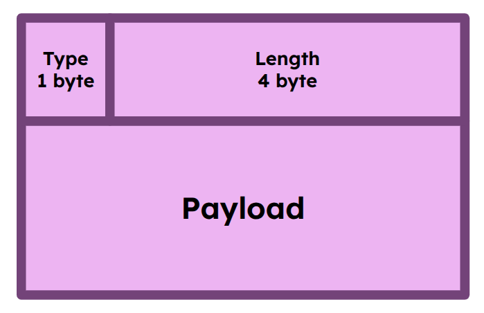
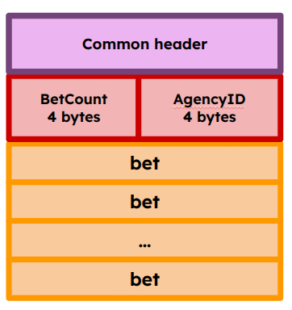
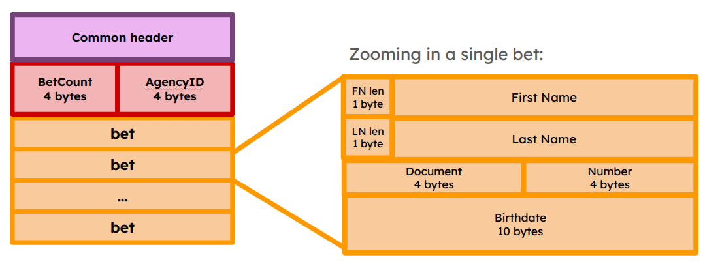
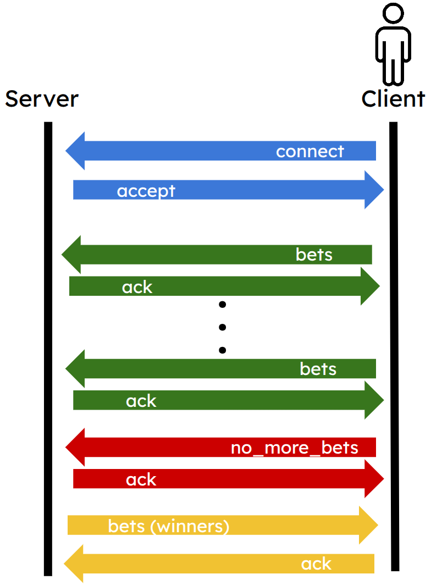

Este documento describe los componentes fundamentales de la arquitectura desarrollada. En las siguientes secciones se detallan el diseño del protocolo sobre sockets TCP y la estrategia de sincronización empleada para gestionar la ejecución concurrente en el servidor.

## 1. Protocolo de Comunicación y Estructura de Paquetes

La interacción entre los clientes y el servidor se fundamenta en el intercambio de mensajes estructurados mediante sockets TCP. Cada uno de estos mensajes se compone de un encabezado de tamaño fijo que precede a un payload de longitud variable.

### 1.1. Header
Cualquier mensaje transmitido en la red tiene el mismo formato:

* **Type (1 byte):** Define la operación o tipo de mensaje. Los códigos válidos son `0` (BETS), `1` (ACK) y `2` (NO_MORE_BETS).
* **Length (4 bytes):** Indica el tamaño total del payload expresado en bytes.

### 1.2. Tipos de Mensajes y Cargas (Payloads)
* **ACK y NO_MORE_BETS:** Estos paquetes poseen un payload completamente vacío (Length = 0).
* **BETS:** Este tipo de mensaje transporta un batch de apuestas. Su carga interna contiene metadatos del batch seguidos de la secuencia de registros.

La metadata agregada es:
* **BetCount (4 bytes):** Número total de apuestas incluidas en el batch.
* **AgencyID (4 bytes)** 

### 1.3. Formato de la Apuesta Individual
Cada una de las apuestas que le siguen a la metadata respeta la estructura ilustrada a continuación:

* **FN Len (1 byte):** Longitud de la cadena del nombre (*First Name*).
* **FirstName (variable):** Nombre del apostador, de acuerdo a la longitud definida en *FN Len*.
* **LN Len (1 byte):** Longitud de la cadena del apellido (*Last Name*).
* **LastName (variable):** Apellido del apostador, de acuerdo a la longitud definida en *LN Len*.
* **Document (4 bytes):** Número de documento del apostador.
* **Birthdate (10 bytes):** Fecha de nacimiento.
* **Number (4 bytes):** Número asignado a la apuesta.

## 2. Flujo de mensajes

El ciclo de vida de la comunicación se desarrolla de la siguiente manera:
1. **Establecimiento:** Se inicializa la conexión TCP entre el cliente y el servidor.
2. **Envío de Batches:** El cliente transmite batches mediante mensajes `BETS`. El servidor procesa cada uno, los almacena y responde de forma inmediata con un mensaje `ACK`.
3. **Cierre de Carga:** Una vez finalizado el envío de todos sus batches, el cliente transmite un mensaje `NO_MORE_BETS` para notificar que concluyó la etapa de carga. El servidor confirma la recepción con un `ACK`.
4. **Cómputo y anuncio de ganadores:** El servidor aguarda hasta que se cumplan las condiciones de quorum global. Al alcanzarse, determina las apuestas ganadoras de la agencia y se las reenvía al cliente en un único paquete `BETS`.
5. **Finalización:** El cliente recibe las ganadoras, las persiste en su archivo local de resultados, responde con un `ACK` final y se procede al cierre de la conexión.

## 3. Modelo de Concurrencia y Sincronización

El servidor adopta una arquitectura concurrente basada en **procesos** para atender múltiples conexiones de forma simultánea.

### 3.1. Roles del Servidor y Procesos
* **Proceso Principal:** Actúa en un bucle de escucha. Ante cada conexión entrante, despliega un proceso *client handler* dedicado y se encarga de instanciar las estructuras de sincronización y el proceso quorum.
* **Proceso Quorum:** Administra la progresión general del sistema mediante dos colas de mensajes:
    * **Cola de Registro (`requests_queue`):** Los *client handlers* depositan aquí el identificador de su agencia (`agency_id`) tras procesar exitosamente el mensaje `NO_MORE_BETS` (habiendo recibido y persistido la totalidad de sus apuestas).
    * **Cola de Liberación (`ready_queue`):** Contiene los tokens de habilitación. Al cumplirse el quorum mínimo de agencias, el proceso quorum libera los permisos necesarios para desbloquear a los procesos en espera. Las agencias que se registran excediendo el quorum obtienen su habilitación de forma inmediata.

### 3.2. Persistencia y Control de Acceso
El acceso al almacenamiento compartido de apuestas se encuentra protegido mediante *locks* del sistema operativo:
* **Escritura:** Bloqueo exclusivo para garantizar consistencia al registrar batches.
* **Lectura:** Bloqueo compartido para permitir consultas simultáneas eficientes.

Durante su ciclo, cada *client handler* recibe los batches del cliente, los persiste aplicando los locks, confirma con un `ACK`, y al recibir él `NO_MORE_BETS` responde con otro `ACK` y se registra en la cola de peticiones, quedando suspendido hasta recibir el token de habilitación. Una vez habilitado, recupera las apuestas ganadoras de su agencia y las comunica al cliente.

## 4. Mecanismo de Shutdown y Cierre Ordenado

La finalización segura del sistema se orquesta también a través de las colas de control:
* Cuando el proceso principal recibe la señal de terminación, suspende la admisión de nuevas conexiones, inyecta un `DIE_TOKEN` en la cola de `ready` por cada *client handler* activo y un `DIE_TOKEN` en la cola de `requests`.
* El proceso quorum procesa el `DIE_TOKEN` de la cola de `requests`, cierra las colas de manera limpia y finaliza.
* De manera simétrica, cada *client handler* que recibe un `DIE_TOKEN` por la cola de `ready` abandona la espera, cierra el socket del cliente y desarma los canales de comunicación compartidos con el proceso quorum.
* De todos modos, el proceso principal luego propaga la señal obtenida para aquellos procesos que no respondieron al enfoque polite. Esto puede darse por estar bloqueados en operaciones I/O por ejemplo.
* Finalmente, el proceso principal consolida el cierre mediante el *join* de todos los hilos/procesos activos, garantizando una salida libre de recursos huérfanos.